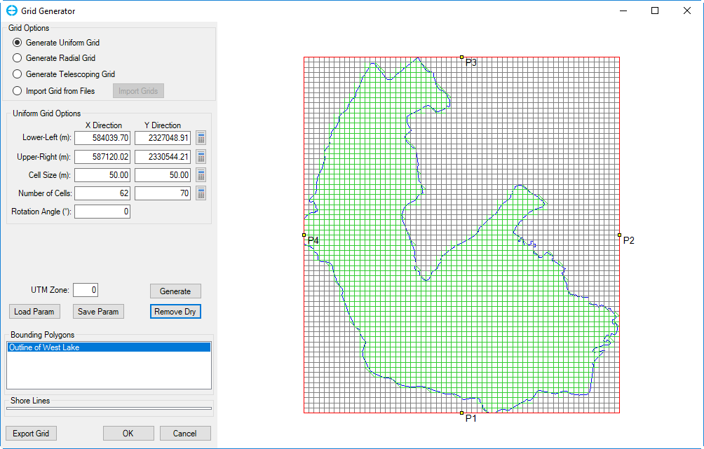

.. _uniformgrid:

Generate Uniform Grid
---------------------

This option allows user to generate a Cartesian grid. When the radial
button for this option is selected, the *Uniform Grid Options* frame is
shown. In this frame the user needs to enter the *Lower-Left* and
*Upper-Right* coordinates, these two corner points will temporarily
limit the grid domain. Next, enter cell size in X and Y directions,
which will define cell dimensions (width and length in meters of a
cell), then click the calculator symbol for *Number of Cells*, the
number of cells will be updated. Another option is that the user enters
the number of cells desired first then click the calculator symbol for
*Cell Size*, and the dimensions of the cell will be updated.

*Rotation Angle*: The user should enter angle in degrees which for the
grid should be rotated.

*UTM Zone*: This is the Universal Transverse Mercator (UTM) zone, the
user can enter the zone number, from 1 to 60.

The user can then click the *Generate* button, and the grid will appear
on the right window as shown in Figure 4.

The user can also change the size of the domain by holding left-mouse
click (LMC) on navigation points (P1, P2, P3, P4) and shifting to
another place in the window. The values of fields of the *Uniform Grid
Options* frame are updated as well.

To save the information entered into the *Uniform Grid Options* frame
select the *Save Parameters* button. A *Save As* form will be displayed
in order to enter a file name, then click the *Save* button to save as
shown in Figure 5. This parameter settings file can be reused at another
time by clicking on the *Load Param* button.

|image3|

**Figure 4.** Generate Uniform Grid.

|image4|

**Figure 5.** Save parameters.

To restrict the size of the domain use a bounding polygon, which is
effectively serves as a shoreline. RMC on the *Bounding Polygons* text
box and select *Add Files.* The *Open* form appears, and the user should
select the file or files needs then click *Open* button as shown in
Figure 6.

The polygon will be loaded and the *Lower-Left*, *Upper-Right*
coordinates will be updated. The user now can generate a grid based on
either cell size or the number of cells by clicking the *Generate*
button. It is also possible inverse the selection, or remove the cells
which are outside of the bounding polygon, by clicking the *Remove Dry*
button as shown in Figure 7.

|image5|

**Figure 6.** Load bounding polygon file.

|image6|

**Figure 7.** Grid generation by using bounding polygon.

Once the grid is generated, the user can save the grid by clicking the
*Export Grid* button. The grid can be exported as *\**.CVL *or \*.*\ GRD
format. Click the *OK* button to finish generating the uniform grid.

After clicking *OK* button, the tool returns to the interface shown in
Figure 1. Select the disk symbol or *Save Model* under *File* from the
interface to save an EFDC+ model for this grid as shown in Figure 8. The
files that saved are shown in Figure 9 and can be loaded by EE10.

|image7|

**Figure 8.** Save EFDC Model for generated grid.

|image8|

**Figure 9.** Files of EFDC Model save out.

.. |image3| image:: media/image4.png
   :width: 6.00000in
   :height: 3.83093in
.. |image4| image:: media/image5.png
   :width: 5.50000in
   :height: 2.80876in
.. |image5| image:: media/image6.png
   :width: 5.50000in
   :height: 3.50214in

.. |image7| image:: media/image9.png
   :width: 6.00000in
   :height: 4.33348in
.. |image8| image:: media/image10.png
   :width: 6.00000in
   :height: 2.38910in

