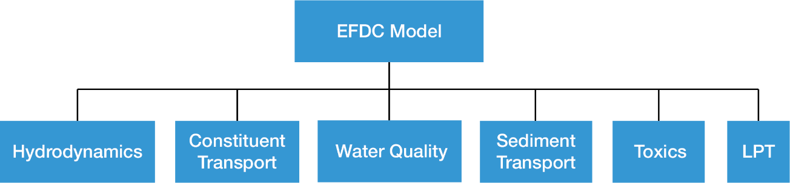

.. _inputfiles:

===========
Input Files 
===========

This section lists and describes the input files required to run different modules within EFDC+. The primary modules within EFDC+ are distinguished in the figure below.

.. toctree::
    :numbered:
    :maxdepth: 2

    runcontrol/index
    spatial/index
    general_transport/index
    sediment/index
    waves
    eutro
    toxics
    temperature
    