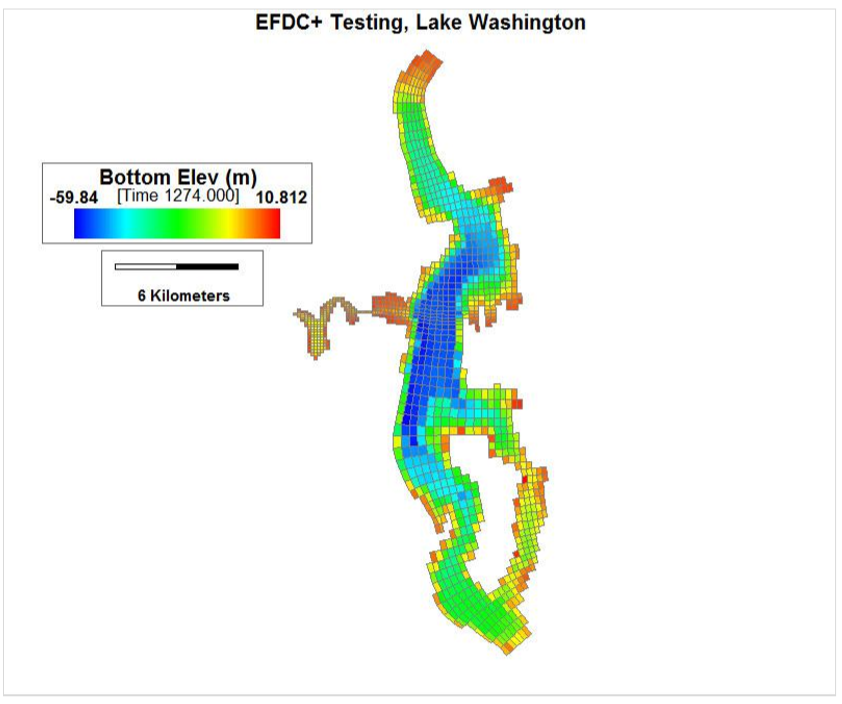

.. _lake_washington :

Lake Washington Test Case 
=========================

A completed sample model of Lake Washington is provided ``SampleModels/Lake_Washington``.  This model can be run with EFDC+ version 8.5 and the grid can be visualized with the `GridGenerator`.

This model simulates hydrodynamics in Lake Washington. The model uses temperature modules with the Sigma-Zed vertical layering option to simulate thermal stratification in Lake Washington, Seattle, USA. The Sigma Zed model is unique to EFDC+ and is designed to reduce pressure gradient errors with an approach that is computationally efficient. 

The model has 1,183 horizontal grid cells and 55 vertical layers.  The model domain is shown in the figure below.

|image1|

