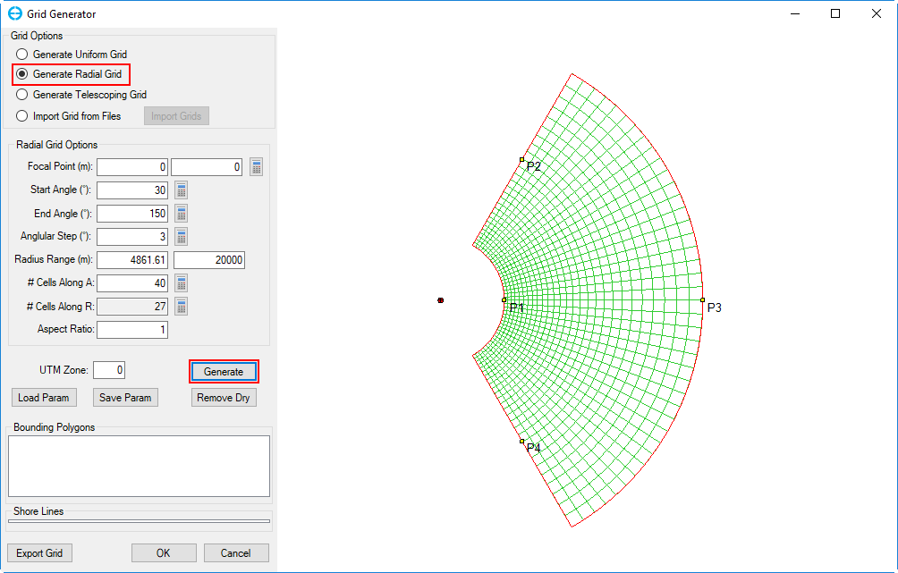

.. _radialgrid:

Generate Radial Grid
--------------------

When you select the *Generate Radial Grid* from *Grid Option* frame, the
default values are filled in the *Radial Grid Options* frame as shown in
Figure 10. The user can define those values as required.

The user can then click the *Generate* button, and the grid will appear
on the right window as shown in Figure 10.

Export the generated grid and save the EFDC model in same way described
in the section, :ref:`uniformgrid`.

|image9|

**Figure 10.** Generate Radial Grid.

